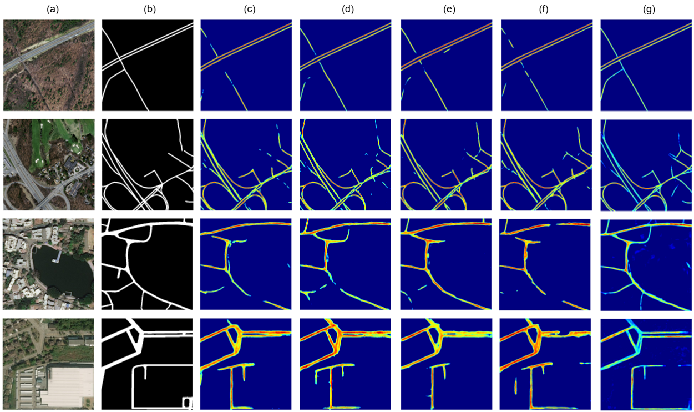

# Road Extraction from Satellite Imagery using Deep Learning

This repository contains code and models for **automatic road extraction** from satellite imagery using deep learning technique.

## 📌 Overview

The goal of this project is to perform **binary semantic segmentation** of roads from high-resolution satellite images. 

🖼️ Sample Predictions
Below are some example results of road extraction:

  

Each result shows:

Left: Original satellite image

Middle: Ground truth road mask

Right: Model-predicted road mask
