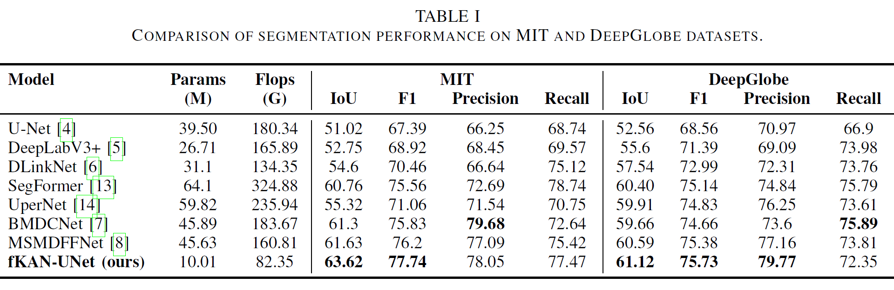
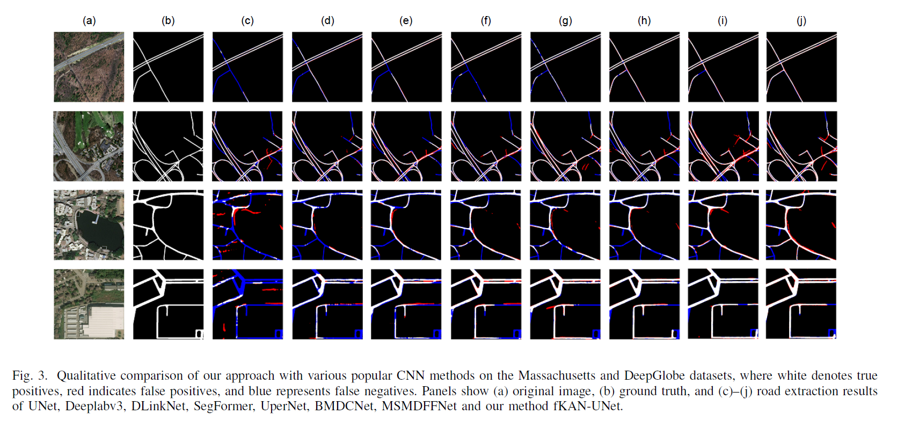
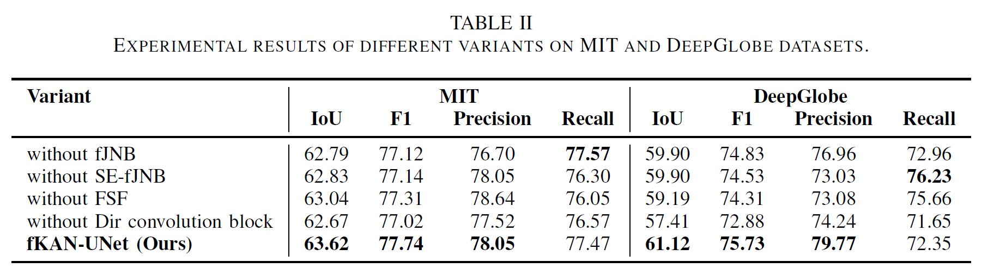
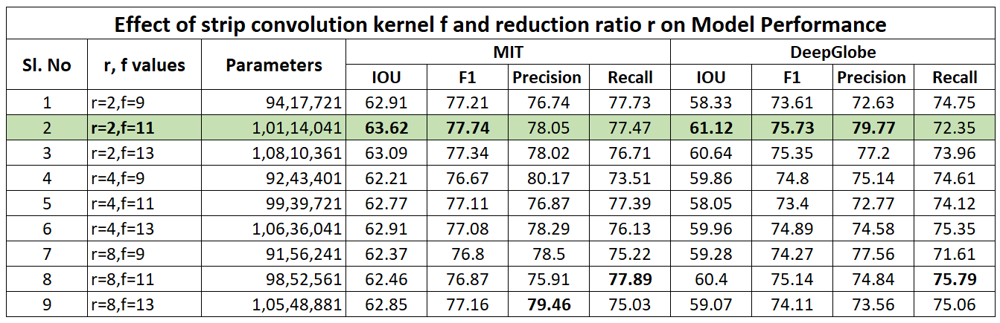
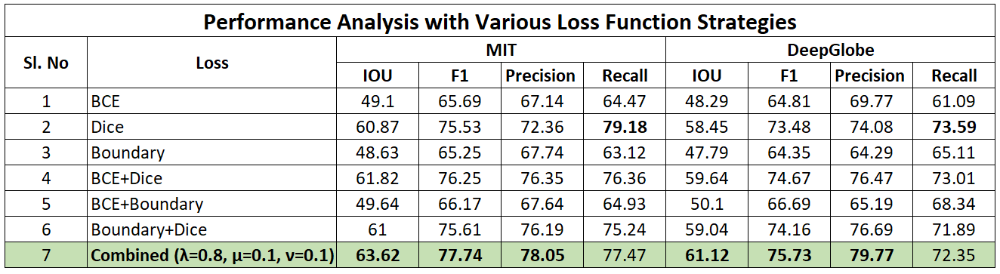
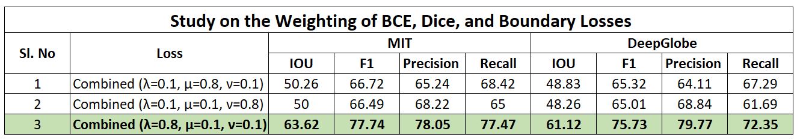

# fKAN-UNet: Lightweight Road Segmentation with Fractional Spectral Modeling and Directional Convolutions

This repository contains code and models for **automatic road extraction** from satellite imagery using deep learning technique.

## Overview

The goal of this project is to perform **binary semantic segmentation** of roads from high-resolution satellite images. 

## Experimental Results

### Model Comparison – Quantitative

  

### Model Comparison – Qualitative

  

### Ablation Study – Quantitative

  

### Hyperparameter Study - Quantitative

  

  

  

