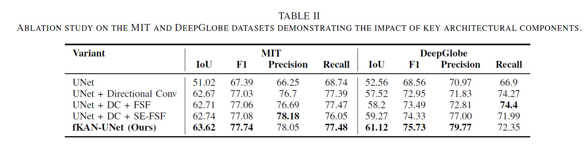

# fKAN-UNet: Lightweight Road Segmentation with Fractional Spectral Modeling and Directional Convolutions

This repository contains code and models for **automatic road extraction** from satellite imagery using deep learning technique.

## 📌 Overview

The goal of this project is to perform **binary semantic segmentation** of roads from high-resolution satellite images. 

## 🧪 Experimental Results

### 🔹 Model Comparison – Quantitative

  

### 🔹 Model Comparison – Qualitative

  

### 🔹 Ablation Study – Quantitative

  

### 🔹 Ablation Study – Qualitative

  

### Hyperparameter Study - Quantitative

  

  

  

